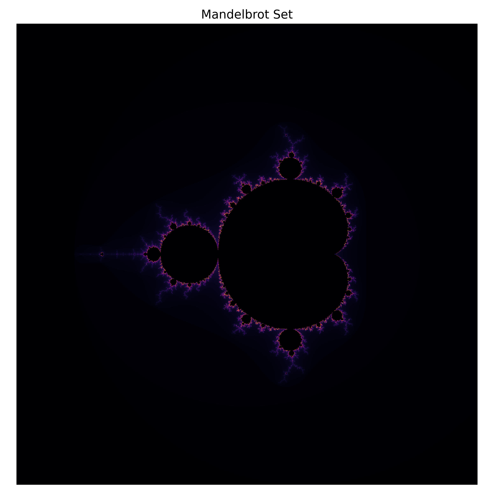
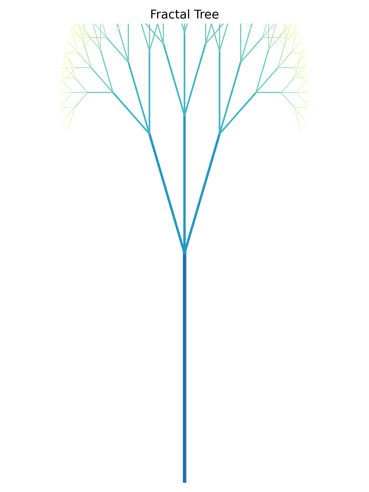
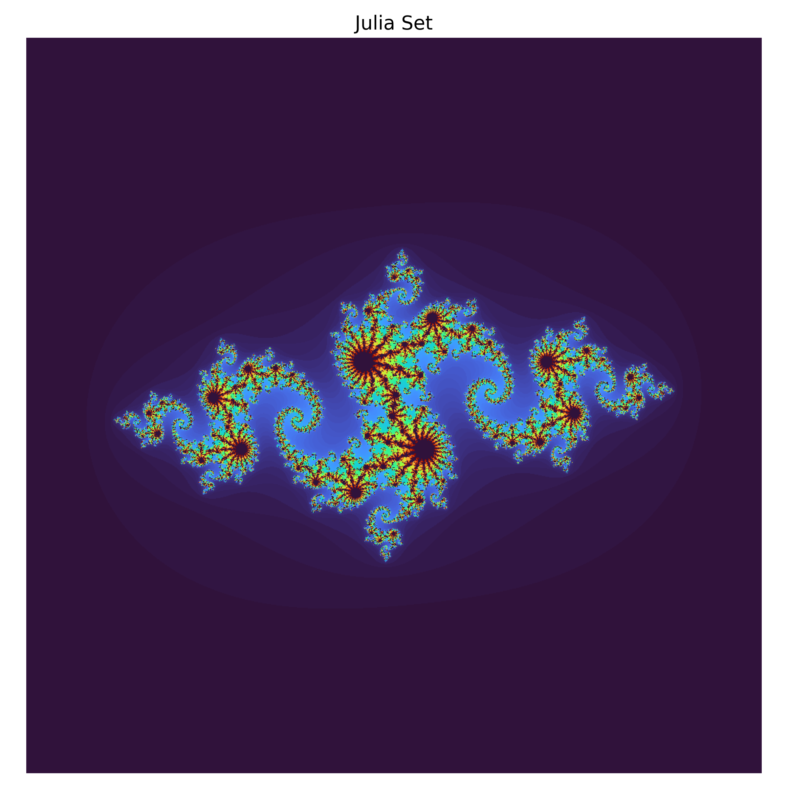

# Fractal Odyssey: Journey Through Infinite Patterns

## Introduction

Fractals are extraordinary mathematical shapes that display **self-similarity**: the same intricate structure appears at different scales. They are generated by repeating a simple process over and over; the result is a pattern that can be zoomed in or out indefinitely.[^fractal] Fractals exist in the fuzzy space between familiar dimensions and appear not only on computer screens but everywhere in nature, from the outline of a coastline to the branching of a tree.[^fractal] Understanding fractals has also led to a deeper appreciation of chaos theory: small changes to the starting conditions of a system can lead to dramatically different outcomes.[^fractal] This odyssey combines narrative, science and generative art to explore the richness of fractal worlds.

## Setting the Stage

Generative art is an art form in which **rules** are defined and then delegated to a computer to produce countless variations.[^generative-art] Unlike a traditional artist who manually shapes a single object, a generative artist designs *processes*: the computer iterates those processes to create unpredictable results.[^generative-art] The synergy between fractals and generative art comes naturally: fractals themselves are the outcome of simple rules repeated recursively, and they are used to generate landscapes, clouds and other naturalistic textures in modern digital design.[^fractal]

In this story you are invited to travel through three fractal realms: **the coast**, **the forest**, and **the cosmos**. Each realm begins with a factual interlude summarizing what we know about that fractal phenomenon, followed by a short piece of generative fiction inspired by the science and accompanied by original images generated in Python. The combination of facts, narrative and visuals offers a layered, multisensory experience.

## Realm I: The Coastline of Endless Detail

### Science interlude

If you trace the edge of a shoreline on a map with increasingly smaller measuring sticks, the measured length keeps growing. This strange property arises because coastlines are *fractal*: their outlines contain details at every scale. Mathematicians studying coastlines found that the measured length increases as the unit of measurement gets smaller.[^coastline] The degree of "wiggliness" is quantified by the **fractal dimension**: the more convoluted the curve, the higher its dimension.[^coastline] Fractal geometry provides a method for capturing the roughness of natural shapes,[^fractal] which explains why it is used in applications ranging from city planning to antenna design.[^applications]

### Fictional glimpse

> *On the shore of an alien sea, you notice that the waves carve patterns that repeat at every scale. You bend down to pick up a grain of sand, only to discover that its jagged surface resembles the shape of the shoreline itself. Walking along the beach, the coast seems infinitely long: no matter how far you travel, new bays and inlets emerge. After hours of wandering you realize that you have been walking inside a fractal, a world where exploration never ends.*

### Visual companion

The image above is a **Mandelbrot set**. Although it is generated by a simple iterative equation, its boundary exhibits infinite complexity, a hallmark of fractals. In our journey the Mandelbrot set stands in for a coastline whose bays and capes echo at every scale.

## Realm II: The Forest of Branching

### Science interlude

Branching patterns appear in numerous natural systems. The branching structure of a tree is fractal: each branch splits into smaller branches that resemble the whole.[^fractal] This self-similarity optimizes the transport of sap and access to sunlight. Fractal branching is not limited to trees; river systems, lightning bolts and networks of blood vessels and lungs all exhibit similar structures.[^fractal] The ability to model these systems with simple fractal rules has influenced medicine; for example, fractal analysis can help distinguish normal and abnormal vascular growth patterns.[^applications]

### Fictional glimpse

> *You enter a forest where every trunk splits into two, then three, then five smaller trunks, each copying the geometry of its parent. The canopy arches above like a network of veins. Following one branch upwards is like exploring a miniature tree within a tree; the process never ends, and the patterns hypnotize you. In the silence you recall that your lungs and veins echo the same logic, and that the forest is not separate from you but a mirror of your own complexity.*

### Visual companion

The tree shown above was drawn by an algorithm using recursive rules: each branch spawns three new branches at scaled lengths and rotated angles. The colours fade as the recursion depth increases, creating a gradient reminiscent of foliage. Such simple rules capture the essence of natural branching.[^fractal]

## Realm III: The Cosmic Spiral

### Science interlude

Fractal geometry extends beyond Earth. The distribution of galaxies in the universe exhibits fractal-like clustering over a range of scales, and fractal mathematics helps astronomers analyse these structures.[^fractal] In computer graphics, fractal algorithms are used to synthesize believable cloudscapes and mountain ranges.[^fractal] In generative art, artists embrace fractal algorithms to discover "happy accidents" and create patterns that feel both natural and otherworldly.[^generative-art]

### Fictional glimpse

> *A cosmic storm swirls around a cluster of stars. At first the spiral appears like any galaxy, but as your telescope zooms in, smaller spirals mirror the larger structure. Each whirlpool contains its own sub-whirlpools, all spinning in synchrony. You realize you are witnessing a **Julia set**, a fractal born from complex numbers but echoing the structure of hurricanes, galaxies and sea shells. The patterns seem infinite, yet they emerge from a simple equation iterated across the complex plane.*

### Visual companion

The colourful spiral above represents a **Julia set** generated using the complex parameter c = -0.8 + 0.156 i. Points whose orbits remain bounded under repeated squaring produce the swirling pattern; points that escape to infinity are coloured by the number of iterations required to escape. Fractal art embraces such iterative rules to produce images that feel simultaneously algorithmic and organic.[^generative-art]

## Reflections and Applications

Benoit Mandelbrot coined the word "fractal," meaning broken or fractional, in the 1970s.[^fractal] He marvelled that fractal geometry could model shapes in the real world that classical Euclidean geometry could not.[^fractal] Today fractals underpin advances in **image compression**, **antenna design**, **medical diagnostics** and **urban planning**.[^applications] Fractal tools help detect cancer by identifying abnormal growth patterns and are used to design multi-band antennas that fit complex curves into compact spaces.[^applications] Beyond the sciences, fractal aesthetics inspire artists and designers to create works that echo natural complexity.

Generative art likewise harnesses computational power to explore huge spaces of possibility. By defining rules and letting the computer run, artists can generate thousands of variations in milliseconds.[^generative-art] They design not a single object but a *process* and are often surprised by the emergent beauty.[^generative-art] Fractals remind us that such emergent complexity need not be planned in detail; it arises naturally from simple iterative rules. Whether modelling coastlines, growing trees, simulating galaxies, compressing images or inspiring art, fractals reveal that the world's apparent chaos is built on underlying order. This fractal odyssey invites us to embrace that interplay between the predictable and the unpredictable, between the rules we set and the surprises they yield.

## References

[^fractal]: [Fractal](https://en.wikipedia.org/wiki/Fractal), Wikipedia.
[^coastline]: Eric W. Weisstein, ["Coastline Paradox"](https://mathworld.wolfram.com/CoastlineParadox.html), Wolfram MathWorld.
[^generative-art]: [Generative art](https://en.wikipedia.org/wiki/Generative_art), Wikipedia.
[^applications]: S. K. Behera, B. K. Kanaujia, and S. K. Koul, ["Fractal Array Antennas and Applications"](https://www.intechopen.com/chapters/60385), IntechOpen.
